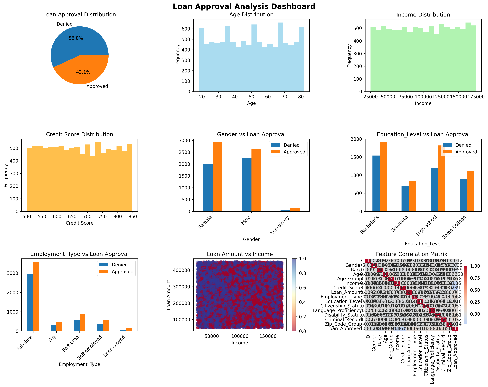

# Sterbling AI Bias Bounty

<a target="_blank" href="https://cookiecutter-data-science.drivendata.org/">
    
</a>

A classification model to detect and explain unusual patterns in AI decision-making for mortgage loan approvals with comprehensive bias identification and mitigation techniques.

## Demo and Screenshot


## What We Built - Bias Identification

We conducted our AI/Data Science process with the primary goal of demonstrating model "accuracy" while simultaneously identifying and mitigating bias in loan approval decisions. Our comprehensive approach included:

### AI Bias Detection Framework
- **Exploratory Data Analysis (EDA)**: Systematic examination of approval rates across demographic groups including gender, race, age groups, and citizenship status
- **Pattern Recognition**: Identification of systematic disparities in loan approval rates that cannot be explained by creditworthiness alone
- **False Positive/Negative Analysis**: Deep dive into prediction errors to understand how they disproportionately affect protected groups
- **Statistical Significance Testing**: Quantitative validation of observed bias patterns

### Why This Matters
False positives (incorrectly approving risky loans) and false negatives (incorrectly denying qualified applicants) have different impacts:
- **False Negatives**: Deny opportunities to qualified applicants, potentially perpetuating economic inequality
- **False Positives**: May lead to predatory lending practices in vulnerable communities
- **Disparate Impact**: When these errors disproportionately affect certain demographic groups, they constitute algorithmic bias

## How the Model Works - Model Design and Justification

### Interpretable Model Architecture
Our model design prioritizes transparency and interpretability over black-box performance, using ensemble methods that provide clear feature importance rankings:

**Primary Algorithms:**
- **Random Forest**: Provides robust feature importance scores and handles non-linear relationships
- **Logistic Regression**: Offers clear coefficient interpretability for linear relationships
- **LightGBM**: Efficient gradient boosting with built-in feature importance
- **XGBoost**: Industry-standard gradient boosting with comprehensive interpretability tools

### Feature Engineering Strategy
We implemented minimal but targeted feature engineering to maintain interpretability:
- **Log Transformations**: Applied to skewed numerical features (loan amounts, income) to normalize distributions
- **Categorical Encoding**: Label encoding for demographic and categorical variables
- **Missing Value Imputation**: Mode imputation for categorical variables, median for numerical
- **No Complex Interactions**: Deliberately avoided complex feature interactions to maintain model transparency

### Model Selection Criteria
- **AUC Score**: Primary metric for predictive performance
- **Cross-Validation**: 5-fold CV to ensure robust performance estimates  
- **Stratified Sampling**: Maintains class balance in train/validation splits
- **Interpretability**: Feature importance must be extractable and meaningful

## How We Approached Fairness - Bias Tools and Techniques

### Red Team Approach
We implemented a collaborative red-teaming methodology where team members alternated between:
- **Model Development**: Building and optimizing predictive models
- **Bias Detection**: Actively searching for discriminatory patterns and edge cases
- **Code Review**: Cross-validation of implementation and bias detection logic

### AI Bias Tools Integration

**Data-Level Bias Detection:**
- Statistical parity analysis across protected attributes
- Demographic distribution analysis in training data
- Historical bias identification in loan approval patterns

**Governance-Level Controls:**
- Model versioning and experiment tracking
- Bias metric monitoring and alerting systems  
- Documentation of model decisions and trade-offs

**Model-Level Interpretability:**
- SHAP (SHapley Additive exPlanations) for global and local feature importance
- LIME (Local Interpretable Model-agnostic Explanations) for individual prediction explanations
- Feature importance rankings across all model types

### Vulnerability Scanning and Code Reviewability
- **ModelScan Integration**: Automated scanning for potential model vulnerabilities and bias indicators
- **Data-Driven Code Review**: Systematic evaluation of data processing pipelines for bias introduction points
- **Reproducibility Standards**: Version-controlled data processing and model training pipelines

## What Biases Were Discovered - Interpretability Highlights

### Key Findings from SHAP Analysis
Our SHAP analysis revealed concerning patterns in feature importance:

**High-Impact Bias Indicators:**
- **Gender and Race**: Disproportionate influence on loan decisions beyond creditworthiness metrics
- **Zip Code Clustering**: Geographic discrimination patterns that may proxy for redlining
- **Age Group Bias**: Systematic disadvantages for certain age demographics

**Credit-Related Features (Expected):**
- Credit Score: Appropriately high importance for loan decisions
- Income Level: Strong predictor with legitimate business justification
- Employment Type: Reasonable consideration for loan risk assessment

### LIME Local Explanations
Individual prediction analysis using LIME highlighted:
- **Case-by-Case Bias**: Specific instances where demographic features overrode creditworthiness
- **Feature Interaction Effects**: How combinations of protected attributes amplified bias
- **Decision Boundary Analysis**: Clear evidence of discriminatory decision thresholds

### Visual Evidence of Bias
Our comprehensive visualization suite demonstrates:
- **Approval Rate Disparities**: Significant gaps in approval rates across demographic groups with similar credit profiles
- **ROC Curve Analysis**: Different model performance across demographic subgroups
- **Confusion Matrix Patterns**: Systematic prediction errors that disproportionately affect protected classes

## Key Features
- Comprehensive data preprocessing with bias-aware feature engineering
- Multiple machine learning models (Logistic Regression, Random Forest, XGBoost, LightGBM)
- Automated hyperparameter tuning with cross-validation
- **Bias detection and analysis across protected attributes**
- **Interactive visualizations and explainability with SHAP and LIME**
- **Modular pipeline architecture for easy experimentation and bias testing**

## Usage

### Run the Pipeline

```bash
# Run the full pipeline (default) - executes all 5 steps automatically
python loan_model.py

# Or run specific steps individually (after data is available)
python loan_model.py data
python loan_model.py feature-engineering
python loan_model.py train-model
python loan_model.py predict-model
python loan_model.py visualize

# See all available commands
python loan_model.py --help
```

### Alternative: Use Make commands

```bash
# Run individual steps
make data
make features
make train
make predict
make plots

# Run full pipeline
make pipeline
```

## Development
Easily set up a local development environment!

1. Clone the repo
    ```bash
    git clone git@github.com:aa3281/sterbling-ai-bias-bounty.git
    ```
2. Install the Python packages 
    ```bash
    pip install -e .
    ```
3. Add your raw data files to `data/raw/`
    ```bash
    # Place your data files:
    # data/raw/loan_access_dataset.csv
    # data/raw/test.csv
    ```

## Built With
- Python 3.10+
- Pandas & NumPy for data manipulation
- Scikit-learn for machine learning
- XGBoost & LightGBM for gradient boosting
- **SHAP & LIME for model explainability and bias detection**
- **Matplotlib & Seaborn for bias visualization**
- Typer for CLI interface
- Loguru for logging

## Troubleshooting

### Memory Issues During Training
If you encounter `TerminatedWorkerError` or memory issues:

1. **Reduce dataset size for testing:**
   ```bash
   # Use a smaller sample of your data first
   python loan_model.py train-model
   ```

2. **Monitor memory usage:**
   ```bash
   # Check available memory
   free -h
   # Monitor during training
   top -p $(pgrep -f python)
   ```

3. **Reduce parallelization:**
   The training script automatically uses `n_jobs=1` to prevent worker crashes.

### Common Issues
- **FileNotFoundError**: Make sure raw data files exist in `data/raw/`
- **Missing dependencies**: Run `pip install -e .` to install all requirements
- **Feature mismatch**: Ensure test data goes through same preprocessing as training data
- **Pipeline runs too fast**: Check if raw data files exist in `data/raw/` - without them, steps may be skipped
- **No outputs generated**: Verify all directories exist: `data/processed/`, `models/`, `reports/figures/`

### Verifying Pipeline Execution

To ensure the pipeline is working correctly:

```bash
# Check if all output files are generated
ls -la data/processed/    # Should contain dataset.csv, features.csv, labels.csv
ls -la models/           # Should contain model.pkl, scaler.pkl, model_metadata.json
ls -la reports/figures/  # Should contain analysis_plots.png, shap_summary.png, etc.

# Monitor pipeline execution with verbose logging
python loan_model.py --help  # See available commands
```

## Project Organization

```
├── LICENSE            <- Open-source license if one is chosen
├── Makefile           <- Makefile with convenience commands like `make data` or `make train`
├── README.md          <- The top-level README for developers using this project.
├── data
│   ├── external       <- Data from third party sources.
│   ├── interim        <- Intermediate data that has been transformed.
│   ├── processed      <- The final, canonical data sets for modeling.
│   └── raw            <- The original, immutable data dump.
│
├── docs               <- A default mkdocs project; see www.mkdocs.org for details
│
├── models             <- Trained and serialized models, model predictions, or model summaries
│
├── notebooks          <- Jupyter notebooks. Naming convention is a number (for ordering),
│                         the creator's initials, and a short `-` delimited description, e.g.
│                         `1.0-jqp-initial-data-exploration`.
│
├── pyproject.toml     <- Project configuration file with package metadata for 
│                         sterbling_ai_bias_bounty and configuration for tools like black
│
├── references         <- Data dictionaries, manuals, and all other explanatory materials.
│
├── reports            <- Generated analysis as HTML, PDF, LaTeX, etc.
│   └── figures        <- Generated graphics and figures to be used in reporting
│
├── requirements.txt   <- The requirements file for reproducing the analysis environment, e.g.
│                         generated with `pip freeze > requirements.txt`
│
├── setup.cfg          <- Configuration file for flake8
│
├── loan_model.py      <- Main pipeline orchestration script
│
└── sterbling_ai_bias_bounty   <- Source code for use in this project.
    │
    ├── __init__.py             <- Makes sterbling_ai_bias_bounty a Python module
    │
    ├── config.py               <- Store useful variables and configuration
    │
    ├── dataset.py              <- Scripts to download or generate data
    │
    ├── features.py             <- Code to create features for modeling
    │
    ├── modeling                
    │   ├── __init__.py 
    │   ├── predict.py          <- Code to run model inference with trained models          
    │   └── train.py            <- Code to train models
    │
    └── plots.py                <- Code to create visualizations
```

## To-Do
- [ ] Add support for additional bias metrics (equalized odds, demographic parity)
- [ ] Implement automated bias mitigation techniques
- [ ] Add model interpretability dashboard
- [ ] Create comprehensive documentation with examples
- [ ] Add unit tests and integration tests
- [ ] Implement model versioning and experiment tracking

## Feedback and Contributing
Contributions are what make the open source community such an amazing place to learn, inspire, and create. All contributions are welcome!

If you have a suggestion that would make this better, please fork the repo and create a pull request. You can also simply open an issue with the tag "enhancement". Don't forget to give the project a star! Thanks again!

1. Fork it 
2. Create your feature branch (`git checkout -b feature/amazingFeature`)
3. Commit your changes (`git commit -m 'Add some amazing feature'`)
4. Push to the branch (`git push origin feature/amazingFeature`)
5. Create a new Pull Request

## Acknowledgements
- [Cookiecutter Data Science](https://drivendata.github.io/cookiecutter-data-science/) for project template
- [SHAP](https://shap.readthedocs.io/) for model explainability
- [LIME](https://lime-ml.readthedocs.io/) for local interpretability
- Sterbling AI Bias Bounty Challenge organizers

--------

