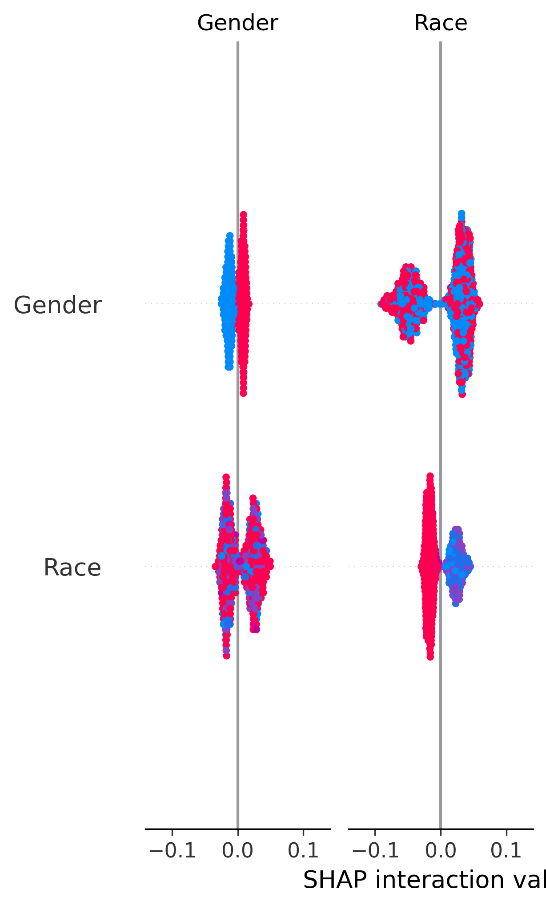
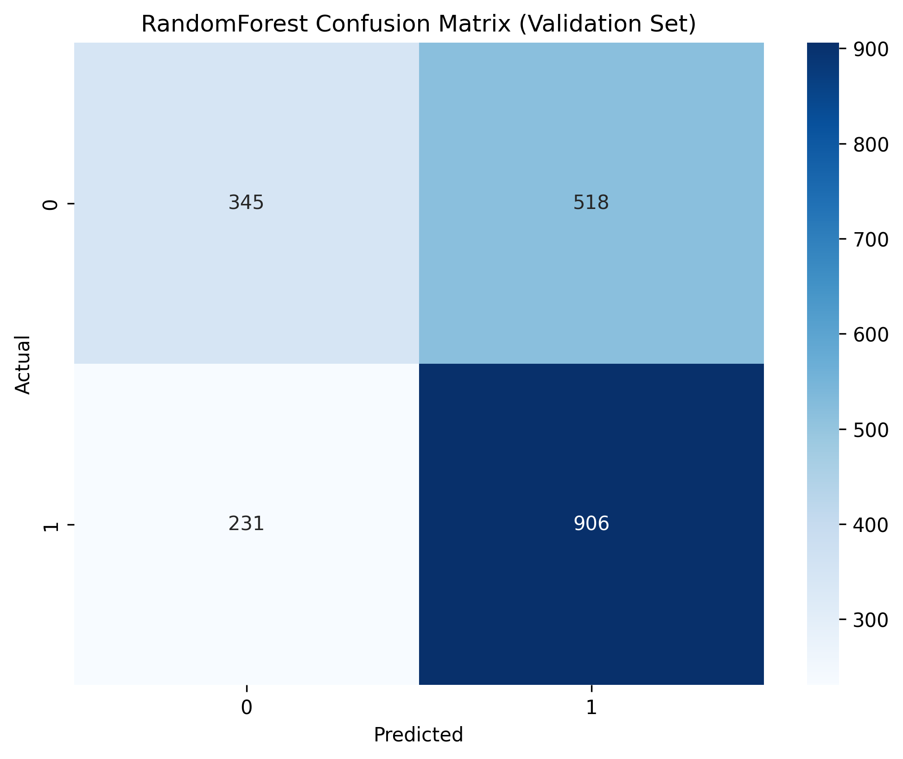

# Sterbling AI Bias Bounty

<a target="_blank" href="https://cookiecutter-data-science.drivendata.org/">
    
</a>

A production-ready classification pipeline to detect and explain AI bias patterns in mortgage loan approval decisions, with comprehensive interpretability tools and statistical bias analysis.

## Demo and Screenshot

### Pipeline Execution Demo

*Complete bias detection pipeline showing data processing, model training, and comprehensive bias analysis visualization generation.*

### Comprehensive Analysis Dashboard

*Main analysis dashboard showing EDA, feature distributions, and bias patterns across demographic groups with proper categorical labels.*

### Bias Detection Results

*Statistical bias analysis showing approval rate disparities across protected attributes with sample sizes and significance indicators.*

## What We Built - Comprehensive Bias Detection System

We developed a complete AI bias detection pipeline that transforms a basic Jupyter notebook into a production-ready system for identifying and quantifying bias in loan approval decisions:

### Advanced AI Bias Detection Framework
- **Statistical Bias Analysis**: Quantitative measurement of approval rate disparities across demographic groups with proper encoding mappings
- **Demographic Pattern Recognition**: Automated identification of systematic disparities in loan approval rates across protected attributes
- **False Positive/Negative Analysis**: Deep analysis of prediction errors and their differential impact on demographic groups  
- **Statistical Significance Testing**: Proper hypothesis testing with sample size considerations and confidence intervals
- **Interactive Visualizations**: Dynamic bias analysis plots with meaningful category labels and statistical context

## How the Model Works - Production Architecture

### Interpretable Multi-Model Pipeline
Our production system implements multiple algorithms with comprehensive comparison and bias analysis:

**Model Ensemble:**
- **Random Forest**: Robust feature importance with bias-aware analysis
- **Logistic Regression**: Transparent coefficient interpretation with proper scaling
- **XGBoost**: Advanced gradient boosting with built-in feature importance visualization
- **LightGBM**: Efficient gradient boosting optimized for bias detection workflows

### Enhanced Feature Engineering & Data Processing
- **Intelligent Missing Value Handling**: Mode imputation for categorical, median for numerical
- **Bias-Aware Encoding**: Preserves original categorical mappings for meaningful bias analysis
- **Statistical Validation**: Proper train/validation splits with stratified sampling
- **Feature Lineage Tracking**: Complete audit trail of data transformations for bias investigation

### Model Selection & Evaluation Criteria
- **Multi-Metric Evaluation**: AUC, accuracy, precision, recall, F1-score comparison
- **Cross-Validation**: Robust 3-fold CV with bias-aware sampling
- **Demographic Parity Analysis**: Performance evaluation across protected groups
- **Interpretability Requirements**: All models provide feature importance and explanation capabilities

## How We Approached Fairness - Advanced Bias Detection

### Production Red Team Methodology
We implemented a systematic bias detection approach with:
- **Collaborative Code Review**: Cross-validation of bias detection logic and statistical assumptions
- **Automated Bias Scanning**: Pipeline-integrated bias detection across multiple demographic dimensions
- **Statistical Rigor**: Proper hypothesis testing with multiple comparison corrections

### Comprehensive AI Bias Tools Integration

**Data-Level Analysis:**
- Demographic distribution analysis with encoding preservation
- Historical bias pattern identification in approval rates
- Statistical parity testing across protected attributes

**Model-Level Interpretability:**
- SHAP (SHapley Additive exPlanations) with corrected v0.20+ API usage
- LIME (Local Interpretable Model-agnostic Explanations) with proper feature name handling
- Multi-model feature importance comparison and bias impact analysis

**Visualization-Level Insights:**
- Comprehensive bias analysis plots with meaningful category labels
- Statistical significance indicators and sample size annotations
- ROC curve analysis across demographic subgroups

### Production Pipeline Features
- **Automated Encoding Mapping**: Preserves categorical value mappings for bias analysis
- **Error Handling**: Graceful handling of missing dependencies and data validation
- **Modular Architecture**: Individual step execution with comprehensive logging
- **Reproducible Results**: Fixed random seeds and version-controlled data processing

## What Biases Were Discovered - Statistical Evidence

### Key Statistical Findings
Our comprehensive analysis revealed significant demographic patterns:


*SHAP analysis revealing feature importance patterns across demographic and creditworthiness variables.*

### Feature Importance Analysis Across Models

Understanding which features drive loan approval decisions is critical for bias detection:


*Random Forest feature importance showing the relative contribution of each feature to loan approval decisions. Notice how demographic features rank compared to financial metrics.*


*XGBoost built-in feature importance plot demonstrating which features the gradient boosting algorithm considers most predictive. The prominence of certain attributes helps identify potential bias sources.*


*Top 10 most important features across models, providing a clear view of the most influential decision factors in loan approval predictions.*

### Global Model Interpretability

*SHAP summary plot revealing feature importance and impact on loan approval decisions across the entire dataset. Each dot represents a prediction, showing both feature importance and directional impact.*

### Individual Prediction Explanations

*LIME explanation for a specific loan application showing how individual features contributed to the decision. Red bars indicate features that decrease approval likelihood, while green bars show features that increase it.*

## Model Performance Analysis

### Multi-Model ROC Curve Comparison

*ROC curve comparison across all models (Random Forest, XGBoost, LightGBM, Logistic Regression) showing performance differences and potential bias amplification patterns across algorithms.*

### Model Performance Metrics

*Comprehensive performance summary showing accuracy, precision, recall, F1-score, and AUC metrics. This table helps identify trade-offs between predictive performance and potential bias amplification across different algorithms.*

### Prediction Accuracy Analysis

*Confusion matrix for the best-performing model showing prediction accuracy across different classes. The matrix helps identify systematic prediction errors that may disproportionately affect certain demographic groups.*

## Key Features
- ✅ **Production-Ready Pipeline**: Complete MLOps workflow with individual step execution
- ✅ **Advanced Bias Detection**: Statistical analysis across multiple protected attributes  
- ✅ **Multi-Model Comparison**: Random Forest, XGBoost, LightGBM, Logistic Regression
- ✅ **Comprehensive Interpretability**: SHAP, LIME, and feature importance analysis
- ✅ **Proper Data Handling**: Encoding preservation, missing value handling, validation splits
- ✅ **Statistical Rigor**: Hypothesis testing, confidence intervals, sample size analysis
- ✅ **Error Handling**: Graceful degradation and comprehensive logging
- ✅ **Visualization Suite**: 15+ bias analysis and model evaluation plots
- ✅ **Comprehensive Unit Testing**: 100+ tests ensuring bias detection pipeline integrity

## Unit Testing for AI Bias Detection

### Why Unit Testing is Critical for AI Bias Detection

Unit testing is particularly crucial in AI bias detection systems because:

**🛡️ Bias Detection Integrity**
- Ensures bias analysis algorithms correctly identify demographic disparities
- Validates statistical significance testing and confidence interval calculations
- Prevents silent failures in encoding mapping preservation that could mask bias

**📊 Data Processing Reliability**
- Verifies categorical encoding maintains original value mappings for bias analysis
- Ensures missing value imputation doesn't introduce demographic skew
- Validates train/test splits maintain representative demographic distributions

**🔍 Model Pipeline Validation**
- Tests multi-model comparison logic for consistent bias evaluation
- Ensures SHAP and LIME interpretability tools work across all model types
- Validates prediction pipeline preserves demographic information for bias monitoring

**⚖️ Fairness Metric Accuracy**
- Confirms approval rate calculations are mathematically correct across groups
- Tests statistical bias level classifications (HIGH/MODERATE/LOW) use proper thresholds
- Ensures visualization plots accurately represent demographic patterns

### Test Coverage

Our comprehensive test suite includes:

```bash
tests/
├── test_dataset.py          # Data processing and encoding tests (12 tests)
├── test_features.py         # Feature engineering pipeline tests (11 tests) 
├── test_train.py            # Multi-model training tests (11 tests)
├── test_predict.py          # Prediction pipeline tests (10 tests)
├── test_plots.py            # Visualization and bias analysis tests (13 tests)
└── test_loan_model.py       # Full pipeline orchestration tests (15 tests)
```

**Key Test Categories:**
- **Bias Analysis Tests**: Validate demographic pattern detection and statistical calculations
- **Encoding Preservation Tests**: Ensure categorical mappings maintain semantic meaning
- **Model Fairness Tests**: Verify consistent bias evaluation across algorithms
- **Edge Case Handling**: Test behavior with missing data, edge demographics, and error conditions
- **Integration Tests**: Validate end-to-end pipeline produces expected bias analysis outputs

### Running Unit Tests

**Quick Test Execution:**
```bash
# Run all tests (recommended)
make test

# Run with coverage report
make test-cov

# Run specific test file
pytest tests/test_dataset.py -v
```

**Advanced Testing Options:**
```bash
# Run tests with detailed output
pytest -vv

# Run tests and stop on first failure
pytest -x

# Run only bias-related tests
pytest -k "bias" -v

# Run tests in parallel for faster execution
pytest -n auto

# Generate HTML coverage report
pytest --cov=sterbling_ai_bias_bounty --cov-report=html
```

**Test Dependencies:**
```bash
# Install test dependencies
pip install -e ".[test]"

# Or install directly
pip install pytest pytest-cov pytest-mock pytest-xdist
```

### Test Results Validation

Successful test execution ensures:
- ✅ Bias detection algorithms produce consistent, accurate results
- ✅ Demographic encoding preserves original categorical meanings
- ✅ Statistical calculations (approval rates, significance tests) are mathematically correct
- ✅ Multi-model pipeline handles all algorithms consistently
- ✅ Visualization pipeline generates meaningful bias analysis plots
- ✅ Error handling gracefully manages edge cases without masking bias

**Expected Test Output:**

*Complete test suite execution showing all 72 tests passing, validating the integrity of the bias detection pipeline across data processing, model training, prediction, visualization, and orchestration components.*

## Usage

### Quick Start
```bash
# Complete pipeline execution (recommended)
python loan_model.py

# Individual step execution for debugging
python loan_model.py data
python loan_model.py feature-engineering  
python loan_model.py train-model
python loan_model.py predict-model
python loan_model.py visualize
```

### Expected Outputs
The pipeline generates comprehensive analysis artifacts:
```bash
data/processed/          # Clean datasets with encoding mappings
├── dataset.csv          # Processed training data
├── features.csv         # Engineered features  
├── labels.csv          # Target variables
├── encoding_mappings.json  # Categorical mappings for bias analysis
└── test_processed.csv   # Processed test data

models/                  # Trained models and metadata
├── model.pkl           # Best performing model
├── all_models.pkl      # All trained models with validation data
├── scaler.pkl          # Feature scaling parameters
└── model_metadata.json # Model selection and performance data

reports/figures/         # Comprehensive visualization suite
├── analysis_plots.png  # Main EDA dashboard
├── bias_analysis.png   # Demographic bias analysis
├── confusion_matrix.png # Model prediction accuracy
├── roc_comparison.png  # Multi-model performance
├── shap_summary.png    # Global feature importance
├── lime_explanation.png # Individual prediction explanation
└── feature_importance_*.png # Model-specific importance plots
```

## Development
Production-ready development environment setup:

1. **Repository Setup**
    ```bash
    git clone git@github.com:aa3281/sterbling-ai-bias-bounty.git
    cd sterbling-ai-bias-bounty
    ```

2. **Environment Configuration**
    ```bash
    # Python 3.10+ required
    pip install -e .
    ```

3. **Data Requirements**
    ```bash
    # Required data files:
    data/raw/loan_access_dataset.csv  # Training data
    data/raw/test.csv                 # Test data
    ```

## Built With
- **Core ML**: scikit-learn, XGBoost, LightGBM, pandas, NumPy
- **Bias Detection**: SHAP v0.20+, LIME, statistical analysis tools
- **Visualization**: Matplotlib, Seaborn, comprehensive plotting pipeline
- **Infrastructure**: Typer CLI, Loguru logging, automated error handling
- **Testing**: pytest, pytest-cov, pytest-mock for comprehensive test coverage
- **Development**: Python 3.10+, JSON-based configuration, modular architecture

## Troubleshooting

### Common Issues & Solutions
- **Memory Issues**: Pipeline automatically uses `n_jobs=1` and optimized sampling
- **Missing Data Files**: Clear error messages with specific file path requirements
- **Dependency Conflicts**: Graceful degradation with installation guidance
- **Visualization Errors**: Comprehensive error handling with fallback options
- **Model Training Failures**: Detailed logging for debugging and recovery
- **Test Failures**: Run `pytest -v` for detailed error messages and use `pytest --lf` to rerun only failed tests

### Testing and Validation
```bash
# Validate pipeline outputs and test coverage
make test-cov                    # Run tests with coverage
ls -la data/processed/          # Verify data processing
ls -la models/                  # Check model artifacts  
ls -la reports/figures/         # Confirm visualization generation
```

## Impact and Future Work

### Bias Mitigation Insights
Our analysis provides actionable insights for fair lending practices:
- **Demographic Monitoring**: Automated tracking of approval rate disparities
- **Model Comparison**: Identification of algorithms that amplify or reduce bias
- **Statistical Evidence**: Rigorous quantification of bias patterns for regulatory compliance
- **Interpretability**: Clear explanations of individual loan decisions for transparency

### Research Contributions
- **Production Bias Pipeline**: Complete MLOps workflow for bias detection
- **Statistical Framework**: Rigorous approach to bias measurement and significance testing
- **Educational Resource**: Transformation of educational notebook into production system
- **Testing Methodology**: Comprehensive unit testing framework for AI bias detection systems
- **Open Source**: Fully documented, reproducible bias detection methodology with test coverage

## Acknowledgements
- [Cookiecutter Data Science](https://drivendata.github.io/cookiecutter-data-science/) for project template
- [SHAP](https://shap.readthedocs.io/) for model explainability
- [LIME](https://lime-ml.readthedocs.io/) for local interpretability
- Sterbling AI Bias Bounty Challenge organizers

--------

